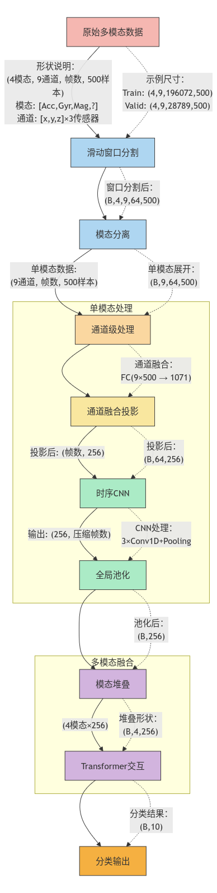

# SHL-2025: 多模态传感器数据分类

基于CNN-Transformer架构的多模态传感器行为识别模型，用于Sequential Hand-Gesture (SHL)数据集的人类活动分类。

## 📋 项目概述

本项目实现了一个先进的多模态深度学习模型，用于从多个传感器模态的数据中进行人类行为分类。网络采用CNN进行特征提取，Transformer进行跨模态融合。



## 🏗️ 项目结构

```
SHL-2025/
├── main.py                 # 主训练脚本
├── plt.py                  # 可视化脚本
├── config/
│   └── train.yaml          # 训练配置文件
├── feeder/
│   ├── __init__.py
│   └── feeder.py           # 数据加载器
├── net/
│   ├── __init__.py
│   ├── net.py              # 网络模型定义
│   └── byol.py             # 对比学习模块
├── util/
│   ├── __init__.py
│   └── parser.py           # 配置解析
├── pre_data/
│   ├── gen_data.py         # 数据处理脚本
│   ├── gen_rfft.py         # FFT变换脚本
│   ├── data-process.ipynb  # 数据处理笔记本
│   └── readme.md           # 数据处理说明
├── data/                   # 数据目录
└── image/                  # 图像资源
```

## 🚀 快速开始

### 前置要求

- Python 3.8+
- PyTorch >= 1.9.0
- CUDA (可选，CPU模式也支持)

### 安装依赖

```bash
pip install -r requirements.txt
```

或手动安装：

```bash
pip install torch numpy pyyaml matplotlib seaborn scikit-learn
```

## 📊 数据处理流程

### 1. 数据准备

将原始SHL数据集解压到`data`目录下，目录结构如下：

```
data/
└── raw_data/
    ├── train/
    └── valid/
```

### 2. 转换为NPY格式

```bash
cd pre_data
python gen_data.py
```

该脚本将原始数据转换为`.npy`格式，输出到`data/npy_data/`。

### 3. 应用FFT变换

```bash
python gen_rfft.py
```

该脚本对数据应用实部FFT(RFFT)变换，生成频域特征，输出到`data/fft_data/`。

### 最终数据结构

```
data/
├── raw_data/          # 原始数据
├── npy_data/          # NPY格式数据
└── fft_data/          # FFT处理后的数据
    ├── train/
    │   ├── data.npy   # (9, 时间步, 1071) 
    │   └── label.npy
    ├── valid/
    │   ├── data.npy
    │   └── label.npy
    └── test/
        └── data.npy
```

## ⚙️ 配置文件

编辑`config/train.yaml`配置训练参数：

```yaml
# 数据路径
train_data_path: /path/to/fft_data/train/data.npy
train_label_path: /path/to/fft_data/train/label.npy
test_data_path: /path/to/fft_data/test/data.npy
valid_data_path: /path/to/fft_data/valid/data.npy
valid_label_path: /path/to/fft_data/valid/label.npy

# 训练参数
batch_size: 2048
epochs: 10
num_epochs: 500
lr: 0.001

# 模型参数
cnn_channels: 9           # 传感器模态数
num_classes: 9            # 分类类别数
num_clusters: 9
update_interval: 5
input_size: 1071          # 特征维度

# 其他参数
window_len: 32            # 滑动窗口长度
stride: 16                # 滑动步长
```

## 🎯 训练模型

### 基本训练

```bash
python main.py
```

训练脚本将：
1. 加载配置文件
2. 初始化数据加载器
3. 构建MultiModalCNNTransformer模型
4. 执行训练循环，每个epoch保存最优模型
5. 生成传感器交互热力图（Attention可视化）
6. 保存测试集预测结果

### 主要特性

- **多模态融合**：支持9个传感器模态的数据
- **Attention可视化**：自动生成传感器交互强度热力图
- **模态dropout**：在训练中随机丢弃模态以增强鲁棒性
- **学习率调度**：使用余弦退火学习率调度器
- **最优模型保存**：基于验证集损失自动保存最优模型
- **VAE缺失模态重建**：利用VAE进行掩蔽模态的重建，增强模型对缺失数据的鲁棒性

## 🏗️ 网络架构

### MultiModalCNNTransformer

模型包含以下主要组件：

1. **ModalProjector**
   - 输入投影层：(输入维度1071 → 隐藏维度256)
   - LayerNorm + ReLU + Dropout

2. **SimplifiedTemporalCNN**
   - Conv1d层：256 → 128 → 256通道
   - BatchNorm + GELU激活
   - MaxPool进行下采样

3. **SimplifiedTransformerBlock**
   - 多头自注意力机制
   - 前馈网络(FFN)
   - LayerNorm + Residual连接

4. **多模态融合**
   - 并行处理9个传感器模态
   - Transformer进行跨模态交互
   - VAE部分用于学习潜在表示与损失重建
   - 最终分类头

## 📈 输出和可视化

### 生成的文件

- `attention_maps/sensor1234_epochN.png` - 传感器交互热力图
- `attention_maps/raw_weights_epochN.npy` - 原始注意力权重
- `test_predictions.npy` - 测试集预测结果
- `output/best_model_*.pth` - 最优模型权重

### 训练日志

每个epoch输出：
```
Epoch 1/500: Train Loss: 2.1963, Acc: 18.26% | Valid Loss: 2.1574, Acc: 22.14%
```

## 📝 数据加载器(Feeder)

`feeder.py`实现了高效的数据加载：

- **滑动窗口分割**：将长时间序列分割成固定长度的窗口
- **模态dropout**：训练中随机丢弃某些模态
- **内存映射**：使用mmap_mode加载大型数据文件
- **灵活的模态丢弃策略**：支持多种dropout策略

参数配置：
```python
Feeder(
    data_path='path/to/data.npy',
    label_path='path/to/label.npy',
    window_len=32,        # 窗口长度
    stride=16,            # 步长
    modal_dropout=True,   # 启用模态dropout
    drop_strategy='random' # dropout策略
)
```

## 🧠 VAE模块说明

该项目集成了变分自编码器(VAE)模块，用于处理缺失传感器模态的问题：

### VAE架构

- **编码器**：将Transformer融合后的特征编码为潜在空间分布（μ和σ）
- **隐层维度**：128维潜在空间
- **解码器**：从潜在空间重建原始模态特征
- **重建头**：将解码特征投影回256维特征空间

### 模态掩蔽策略

在训练时，VAE模块采用以下策略：

1. **随机掩蔽**：以概率`mask_prob`(默认0.5)随机选择一个模态进行掩蔽
2. **特征保存**：保存原始模态的CNN特征用于重建损失计算
3. **联合训练**：分类损失和VAE损失联合优化

### 损失函数

```python
# 总损失 = 分类损失 + VAE损失
# VAE损失 = 重建损失(MSE) + β × KL散度
```

- **重建损失**：使用MSE损失重建掩蔽模态的特征
- **KL散度**：约束潜在空间分布接近标准正态分布

### 在训练中使用VAE

修改`main.py`中的训练循环以支持VAE损失：

```python
# 训练循环中
for inputs, labels in train_loader:
    inputs = inputs.to(device).float()
    labels = labels.to(device)

    optimizer.zero_grad()
    
    # 前向传递
    logits, vae_outputs = model(inputs, is_training=True, mask_prob=0.5)
    
    # 计算分类损失
    loss_cls = criterion(logits, labels)
    
    # 计算VAE损失
    loss_vae, recon_loss, kl_loss = model.compute_vae_loss(vae_outputs, beta=0.1)
    
    # 总损失
    total_loss = loss_cls + loss_vae
    
    total_loss.backward()
    optimizer.step()

# 验证/测试时（不使用VAE）
logits, _ = model(inputs, is_training=False)
```

## 🔧 常见问题

### Q: 数据加载失败
**A**: 检查配置文件中的数据路径是否正确，确保数据文件存在且格式为`.npy`。

### Q: 内存不足
**A**: 减小`batch_size`在配置文件中，或使用数据的mmap模式。

### Q: GPU显存不足
**A**: 减小批次大小或模型隐藏维度，或使用混合精度训练。

### Q: 模型性能不理想
**A**: 尝试调整学习率、dropout率、或增加训练epoch数。

### Q: VAE损失的权重β如何选择？
**A**: β平衡重建损失和KL散度。通常从0.01-1.0之间选择。较小的β(0.01-0.1)偏向重建，较大的β(0.5-1.0)偏向正则化。

## 📚 主要模块说明

### main.py
- 训练循环实现
- 模型评估
- 最优模型保存和加载
- 注意力权重可视化

### net.py
- 多模态CNN-Transformer模型定义
- 各个组件(投影层、CNN、Transformer)的实现

### feeder.py
- PyTorch Dataset类
- 数据预处理和增强
- 滑动窗口分割

### util/parser.py
- YAML配置文件解析

### byol.py
- 对比学习模块实现

该项目集成了变分自编码器(VAE)模块，用于处理缺失传感器模态的问题：

### VAE架构

- **编码器**：将Transformer融合后的特征编码为潜在空间分布（μ和σ）
- **隐层维度**：128维潜在空间
- **解码器**：从潜在空间重建原始模态特征
- **重建头**：将解码特征投影回256维特征空间

### 模态掩蔽策略

在训练时，VAE模块采用以下策略：

1. **随机掩蔽**：以概率`mask_prob`(默认0.5)随机选择一个模态进行掩蔽
2. **特征保存**：保存原始模态的CNN特征用于重建损失计算
3. **联合训练**：分类损失和VAE损失联合优化

### 损失函数

```python
# 总损失 = 分类损失 + VAE损失
# VAE损失 = 重建损失(MSE) + β × KL散度
```

- **重建损失**：使用MSE损失重建掩蔽模态的特征
- **KL散度**：约束潜在空间分布接近标准正态分布

### 使用方法

训练时启用VAE：
```python
logits, vae_outputs = model(inputs, is_training=True, mask_prob=0.5)
if vae_outputs is not None:
    vae_loss, recon_loss, kl_loss = model.compute_vae_loss(vae_outputs, beta=0.1)
    total_loss = classification_loss + vae_loss
```
